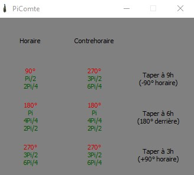

# PiComte

## Introduction
Ce mini programme à été crée pour le jeu dofus pour les combats contre le comte harebourg, il à été fait de manière à ce que l'on puisse rapidement savoir si il faut taper à droite ou à gauche, comme les cartes de combat de dofus sont au format 4/3, le programme est prévu pour se placer sur la partie de l'écran non utilisée en combat. De plus, le programme garde le focus en permanance donc rend le multicompte possible.
Voici une image d'exemple:




## Utilisation

** requiert visual c++ 2019 x64 d'installer, disponible ici: ** [lien](https://support.microsoft.com/fr-fr/help/2977003/the-latest-supported-visual-c-downloads) 

[lien direct](https://aka.ms/vs/16/release/vc_redist.x64.exe)


1. Télécharger la dernière release ici: (insérer le lien de la build release ici)

2. Décompresser l'archive où vous le voulez

3. Lancez PiComte.exe

## Compilation

Pour les personnes qui souhaitent le compiler pour éventuellement le modifier:

``` sh
cd build/
cmake .. ( -G " Générateur à utiliser " -autres options)
```

Le makefiles généré crée une cible release ainsi qu'une cible debug :

``` sh
make release
```

Compile avec des options d'optimisation (-O3 dans le cmakelists, a modifier si vous le souhaitez)

``` sh
make debug
```

Compile avec les options de debogage

``` sh
make releasewithdebug
```

Compile en mode release mais permet le debogage


## Changelog

V1.0: release